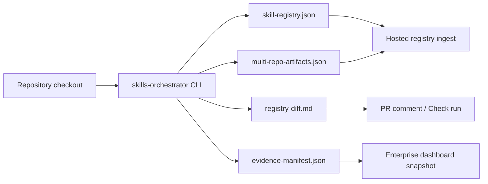

# GitHub App Blueprint

This is a product boundary document, not an implementation. The OSS repository does not include a
GitHub App server.

## Minimum Permissions

Recommended starting permissions:

```yaml
contents: read
metadata: read
pull_requests: write
checks: write
```

Use `security-events: write` only when the app uploads SARIF to Code Scanning. Do not request
administration, members, secrets, or organization write permissions for the initial product.

## Events

Initial webhook events:

- `pull_request`: render registry diff comments and checks.
- `push`: ingest default-branch registry/evidence snapshots.
- `check_suite`: link SkillOps evidence to CI state.
- `workflow_run`: ingest published evidence artifacts after trusted workflows complete.

## Artifact Flow



The app should call the CLI or consume workflow artifacts. It should not reimplement parser,
resolver, registry diff, or policy pack logic.

## Idempotent PR Comments

Use the marker:

```md
<!-- skills-orchestrator:registry-diff-comment:v1 -->
```

The app updates the newest existing comment containing the marker. It does not post a new comment
for every CI run.

## Failure Boundaries

- If the app cannot comment, CI artifacts should still contain the Markdown report.
- If registry diff cannot be computed, report a check failure with the CLI stderr, not a partial
dashboard state.
- If the pull request comes from an untrusted fork, avoid `pull_request_target` unless the checkout
and command execution model has been separately reviewed.

## Contract

Validate installation payloads with:

```bash
skills-orchestrator schema validate \
  --kind github-app-installation \
  --input examples/commercial-handoff/installation.json
```

The adoption fixture for external consumers is:

```bash
skills-orchestrator schema validate \
  --kind github-app-installation \
  --input examples/external-consumer/github-app-installation.json
```
